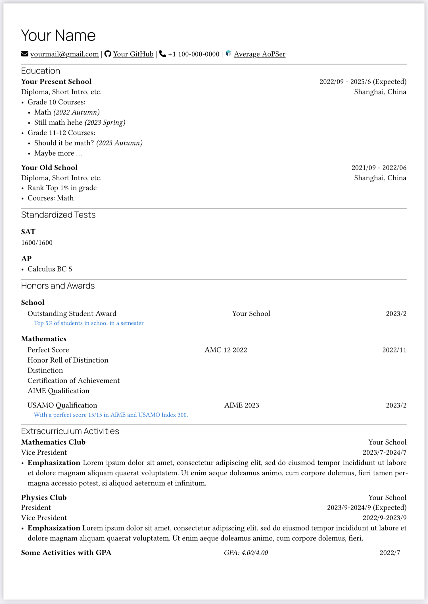

# My own CV template in Typst based on [typst-chi-cv-template](https://github.com/matchy233/typst-chi-cv-template)

This is my first time trying to change a template in Typst and this helped me in getting familiar with `typst` functionalities. And I think errors or some shortages are inevitable so PRs and questions are of course welcomed :)

## New content and what existing problem
Since I am a high school student, I create some new functions ~~it's so unfamiliar with the name "function" because I always use "environment" referring to LaTeX~~ so that a few contents in a (high-school-student) CV may fit it better.
- A `#grade` function for education experiences with GPA.
- An `#honor` function for single honor. `tl` for the name of honor, `tc` for the institution, `tr` for time, and `content` for an explanation of some unfamiliar awards.
- A `#multihonor` function for multiple honors in a single contest. However, I don't really find a way to make loops in `typst`. So my solution is just to put one award in `tl` and others in `content`, and change lines using `#linebreak()`. 
- A `#cventryplus` with another two parts `ml` and `mr`. I create this because I have different jobs in the same activities. (To be specific, vice president in 2022 and president in 2023).

I'll be glad if someone can help me solve the `#multihonor` and  `#cventryplus` problem :)

PS: I create an svg file of AoPS small logo `AoPS_small_logo.svg` as an icon.

## Usage
### Using Typst web app

Upload `chicv.typ`, `fontawesome.typ`, `resume.typ`, `AoPS_small_logo.svg` (if u also want to show your AoPS account at the beginning of CV) and `fonts/FontAwesome6.otf` to [Typst](https://typst.app/), and then you can edit the CV.

## Sample Output

[PDF file](CV-sample.pdf)
